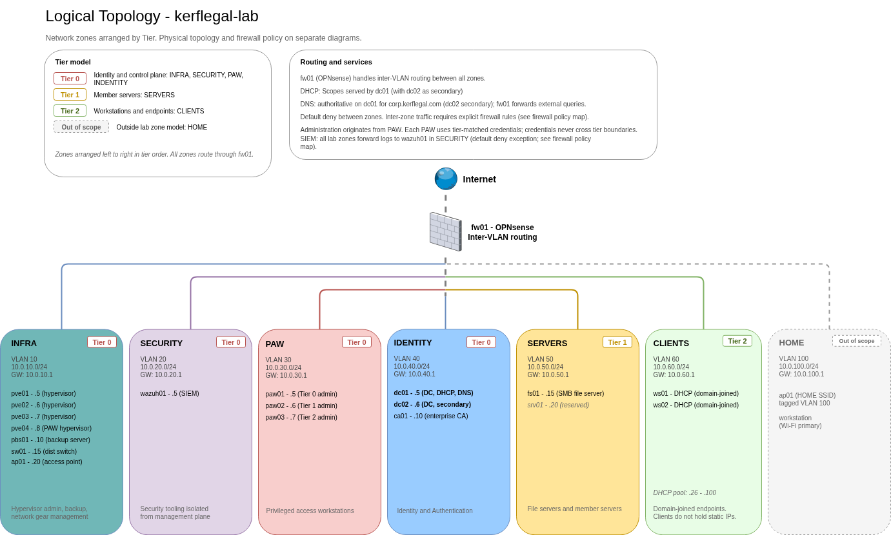

# kerflegal-lab

A production-shaped Active Directory lab built around Microsoft's three-tier administrative model, with six segmented network zones and default-deny between them. Every architectural decision is captured in an ADR, including the alternatives that were rejected.

**Stack:** OPNsense, Proxmox VE, Proxmox Backup Server, Wazuh, Windows Server, Active Directory Domain Services, Active Directory Certificate Services.

## Architecture

Physical topology and firewall policy map are in [diagrams/](diagrams/).

## Repository layout

<pre>
kerflegal-lab/
├── README.md
├── <a href="build-log/">build-log/</a>     narrative writeups for each build phase, added as phases complete
├── <a href="decisions/">decisions/</a>     architecture decisions, each recording the alternatives considered. See the <a href="decisions/README.md">ADR index</a>.
├── <a href="design/">design/</a>        network design, IP and VLAN scheme, physical provisioning, diagrams reference
├── <a href="diagrams/">diagrams/</a>      draw.io source and exported PNGs for the lab's topology
└── <a href="procedures/">procedures/</a>    device-specific procedures, ordered by execution sequence
</pre>

Environment-specific artifacts (CIS control mapping, change log, device records, account registry, private procedure detail) are gitignored and held outside the public repo.
