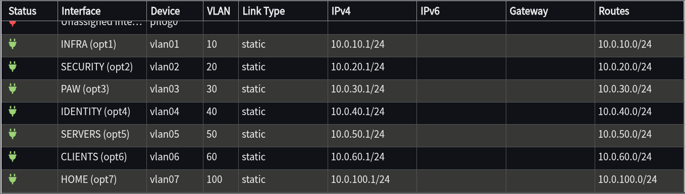

# Network Buildout - April 2026

This writeup covers the first phase of a production-shaped Active Directory lab, getting the network up and segmented before any of the workloads arrive.

## Topology

Physical topology and firewall policy map are in [diagrams/](../../diagrams/).

## Hardening

Before the firewall starts carving zones, it should be trustworthy itself. The [OPNsense baseline](../../procedures/01-fw01-opnsense-initial-configuration.md) goes in first. The GUI moves to HTTPS only on a non-standard port, and the admin account becomes a named user with root demoted to a console-only break-glass. SSH accepts keys but no passwords. DNS resolution runs through Unbound with DNS over TLS to Quad9, and a packet capture confirms only port 853 traffic on WAN.

TOTP came off the firewall during this work. The OPNsense auth model requires Local Database to stay in the GUI authentication chain. Remove it and the GUI keeps working while the physical console rejects every password. I hit that during the build and recovered through single-user mode. Any later MFA work has to add a factor without breaking root's console access.

## Segmentation

On a flat network, the only thing stopping a compromised workstation from reaching a domain controller is the DC's own firewall, and an attacker with local admin can turn that off in seconds. The boundary between tiers has to live in the network itself, somewhere a compromised host cannot reach.

That is what the seven zones are for. INFRA, SECURITY, PAW, IDENTITY, SERVERS, and CLIENTS each sit on their own VLAN, alongside a HOME zone for personal traffic, outside the lab's tier model. The firewall refuses traffic across those boundaries unless a rule names it.

No inter-zone allow rules exist yet. The ones that will be added as workloads come online are narrow. The firewall will allow domain authentication from CLIENTS and SERVERS into IDENTITY, log traffic from every zone into Wazuh, and PAW sessions reaching only the tier each PAW administers. Tier 0 is split four ways rather than collapsed, so a compromise inside it does not grant the rest. The full VLAN and IP scheme is in [network-design.md](../../design/network-design.md), and [ADR-0006](../../decisions/ADR-0006-network-segmentation-and-ip-vlan-scheme.md) covers the alternatives I considered.

## Switch

The switch carries the other half of the enforcement. Every VLAN that the firewall expects on its trunk has to be configured at the switch end, every host that lives on a single zone gets an access port pinned to that zone, and every unused port is admin-down so a stray cable cannot find its way onto an active VLAN. The [switch buildout procedure](../../procedures/03-sw01-initial-configuration.md) walks through it.

The work is in the order. The switch was being managed over the same flat LAN it was about to retire, so the procedure stages ports in a careful sequence. Untouched ports first, then non-management trunks. The two ports carrying the live management session were held until the end. The final step moves the switch's management IP from the flat LAN to 10.0.10.15 on VLAN 10, which intentionally drops the session and leaves the switch dark until the firewall trunk feeds it the right tag.

## Cutover

The cutover is where the work gets dangerous. You have to replace the LAN you are managing on without losing access to the device you are managing. The workstation moves first, every management path is validated from its new home, and only then can the old LAN come down. I walked through the procedure twice on paper and still found two ways to lock myself out, both written up in the [cutover procedure's](../../procedures/04-network-cutover.md) troubleshooting section.

The OPNsense `LAN address` rule token is not symbolic. It is bound to whatever interface is named LAN, so deleting that interface silently deactivates every rule that referenced it. If the rule keeping you logged into the firewall is one of them, you find out by losing your session.

## Wireless

The same cable that powers the AP carries both wireless traffic and the AP's own management traffic, and on a single VLAN those two share an attack surface. So they get separate VLANs. [ap01](../../procedures/05-ap01-initial-configuration.md) sits at 10.0.10.20 on INFRA with the rest of the management plane and broadcasts a single SSID on VLAN 100 for personal traffic. No lab SSIDs exist, by design. Lab workloads belong on wired ports with documented VLAN membership, not on a radio anyone in range can probe.

## Next phase

The network is now a clean canvas. The zones are empty and the firewall refuses anything it has not been told to allow. The next phase fills the canvas. A three-node Proxmox cluster comes up alongside a dedicated PAW hypervisor outside the cluster and a Proxmox Backup Server. AD domain controllers and a CA land in IDENTITY, and a Wazuh SIEM in SECURITY begins ingesting from every zone.

## Where to look

- [`design/`](../../design/) - network, compute, and provisioning designs
- [`decisions/`](../../decisions/) - every architectural call with the alternatives rejected
- [`procedures/`](../../procedures/) - device by device steps with rollback and troubleshooting
- [`diagrams/`](../../diagrams/) - logical, physical, and firewall policy maps
