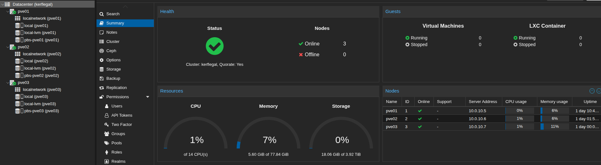
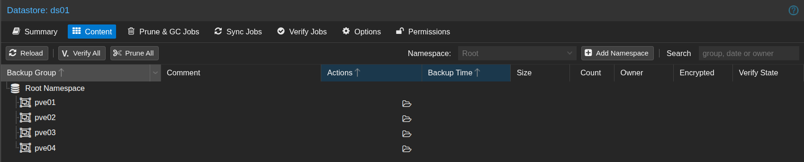

# Compute and Backup Buildout - May 2026

This phase fills the empty network with compute and backup. A three-node Proxmox cluster brings high availability to the bulk of the lab's workloads, while a fourth Proxmox host stands apart as the dedicated home for the privileged access workstations. A Proxmox Backup Server rounds out the picture on its own hardware, ready to receive backups from all four.

## The cluster

Three nodes, pve01 through pve03, form the cluster. Three is the smallest count that holds quorum without a tiebreaker, so the cluster survives any single host failure on a two-of-three vote.

The less obvious choice is what runs where. Workloads are not pinned to specific hosts by tier. A hypervisor can read every guest's memory and disk, so the entire cluster control plane is treated as Tier 0 regardless of what runs on it. Tier separation lives above the hypervisor, in the network, the accounts, the PAWs, and group policy. That frees VM placement to optimize for hardware fit and redundancy. Full reasoning in [ADR-0013](../../decisions/ADR-0013-cluster-storage-and-replication.md).

Corosync, the cluster's heartbeat protocol, runs on its own VLAN rather than the management network. It has no firewall interface and no gateway, since the protocol only ever talks between the three cluster nodes. Reasoning in [ADR-0016](../../decisions/ADR-0016-dedicated-cluster-vlan.md).

The first join attempt failed because the PVE web certificate is only bound to each node's management IP. Pointing the join at the management IP let the bootstrap complete while corosync itself continues to ride the dedicated VLAN.

## The standalone PAW hypervisor

A fourth Proxmox host, pve04, sits outside the cluster. The hypervisor running the privileged access workstations should not be the same hypervisor those PAWs administer. If the cluster's hypervisor plane is ever breached, the PAWs an admin reaches for to investigate cannot already be inside it. Detailed argument in [ADR-0010](../../decisions/ADR-0010-dedicated-paw-hypervisor.md).

pve04 was baselined with the same procedure as the cluster nodes. Its switch port carries fewer VLANs since it never hosts workloads outside the management and PAW zones.

## Storage and replication

Each Proxmox node has a small NVMe for the OS and a separate SSD for VM disks. The SSD is a ZFS pool named `vmpool` on every host, identical naming intentionally so per-VM replication can address peers by storage ID. There is no shared SAN or NAS.

HA on the cluster uses Proxmox storage replication, sending ZFS snapshots between nodes on a per-VM schedule. The recovery point for any given VM is its replication interval, and on a host failure HA restarts the VM from the latest snapshot on a surviving peer. Alternatives considered (NFS off the backup server, Ceph across the cluster, dedicated SAN) are all in [ADR-0013](../../decisions/ADR-0013-cluster-storage-and-replication.md).

## Backup

pbs01 is dedicated to backups and runs nothing else. It carries a ZFS mirror across two 1TB drives as the datastore (`ds01`), with a daily verify job watching for bit rot.

The credential model is the part worth understanding. Each Proxmox node has its own API token into PBS, scoped to a per-node namespace inside `ds01`. The token can write backups but cannot delete or prune them. A compromise of any single node can fill its own namespace with junk but cannot reach into another node's history or wipe what is already there. Pruning is handled by a separate process on PBS, never by the per-node tokens. This is the prune protection from [ADR-0014](../../decisions/ADR-0014-backup-architecture.md).

Setting this up was where the phase had its biggest hangup. PBS computes a token's effective permissions as the intersection of the token's own ACL entries and those of the user that owns it. I assumed the token's own ACLs were sufficient. They are not. With the user holding no permissions, the intersection was empty no matter how the token was set up, and nothing worked. The fix was to grant the user a broader role on the same path, letting the intersection produce the narrow permission the token was meant to have. The corrected pattern and the troubleshooting entry both live in [procedure 10](../../procedures/10-pbs-pve-integration.md).

## Next phase

The infrastructure is now ready to host workloads. The first domain controller and certificate authority land in IDENTITY, member servers in SERVERS, and the three PAWs come up on their assigned hosts once the domain exists for them to join. The decision to domain-join the PAWs rather than run them as workgroup boxes is in [ADR-0017](../../decisions/ADR-0017-domain-joined-paws.md).

## Where to look

- [`design/`](../../design/) - network, compute, and provisioning designs
- [`decisions/`](../../decisions/) - every architectural call with the alternatives rejected
- [`procedures/`](../../procedures/) - device by device steps with rollback and troubleshooting
- [`diagrams/`](../../diagrams/) - logical, physical, and firewall policy maps
