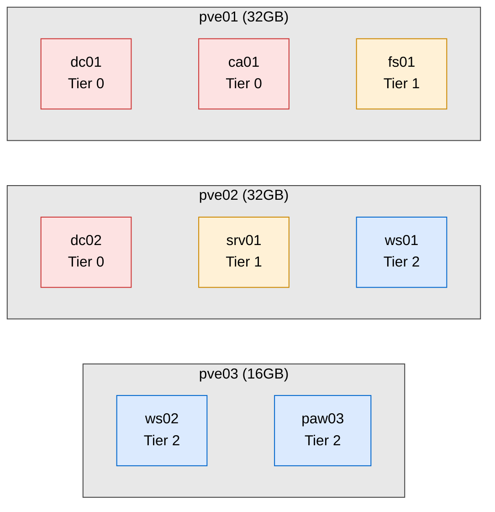
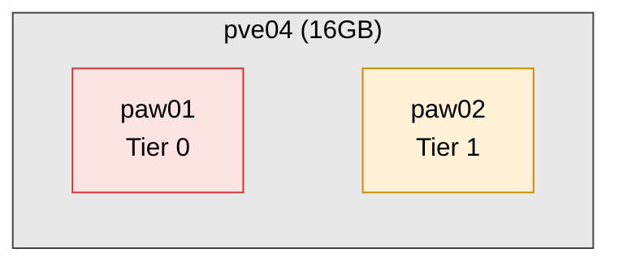

# Compute Design

Proxmox hypervisor architecture and VM placement.

## 1. Cluster Architecture

Three-node Proxmox cluster with HA enabled. Workloads distribute across nodes rather than pin by tier. Tier separation is enforced at the network, firewall, credential, and identity layers.

| Node | CPU | RAM | Role |
|---|---|---|---|
| pve01 | Intel Core i7 8th Gen | 32GB | Cluster primary, strongest CPU |
| pve02 | Intel Core i5 7th Gen | 32GB | Cluster node |
| pve03 | Intel Core i5 7th Gen | 16GB | Cluster node, RAM-constrained |

Backup to pbs01 on dedicated hardware.

## 2. Storage

Each node has a primary NVMe and a secondary SSD. Pool layout is deferred to an ADR written when the cluster is built.

## 3. Network Integration

Each cluster host connects to sw01 on a trunk carrying VLANs 10, 30, 40, 50, and 60. pve04 connects on a trunk carrying VLANs 10 and 30. VLAN tagging terminates on Linux bridges inside Proxmox so each VM attaches to the bridge for its target zone. Management lives on VLAN 10.

## 4. Cluster VM Placement (Initial)

Principles:

- dc01 and dc02 on separate hosts to survive a single node failure.
- pve01 hosts the primary DC and CA (strongest CPU).
- pve03 hosts Tier 2 workloads (lowest RAM in cluster).

## 5. PAW Hypervisor

pve04 is a standalone Proxmox host dedicated to Tier 0 and Tier 1 administrative workstations. It sits outside the cluster to isolate privileged admin credentials from hypervisor-plane compromise of the cluster.

paw03 remains on pve03 in the cluster. Tier 2 compromise scope is limited to workstation administration and is accepted for the current hardware state.