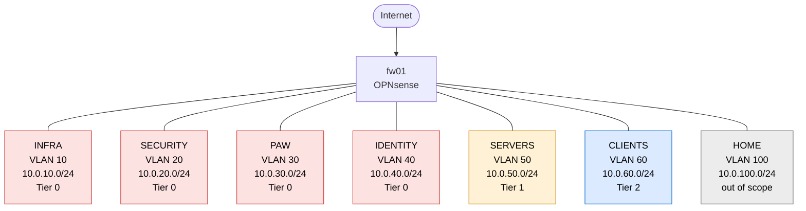

# Network Design

Network layout for the lab.

## Logical Topology

## 1. VLAN and Subnet Design

| Zone | VLAN ID | Subnet | Gateway | Tier | Purpose |
|---|---|---|---|---|---|
| INFRA | 10 | 10.0.10.0/24 | 10.0.10.1 | 0 | Hypervisor admin, PBS, network gear management |
| SECURITY | 20 | 10.0.20.0/24 | 10.0.20.1 | 0 | Wazuh SIEM, future security tooling |
| PAW | 30 | 10.0.30.0/24 | 10.0.30.1 | 0 | Privileged access workstations |
| IDENTITY | 40 | 10.0.40.0/24 | 10.0.40.1 | 0 | DCs, CA |
| SERVERS | 50 | 10.0.50.0/24 | 10.0.50.1 | 1 | File servers, member servers |
| CLIENTS | 60 | 10.0.60.0/24 | 10.0.60.1 | 2 | Domain-joined Windows workstations |
| HOME | 100 | 10.0.100.0/24 | 10.0.100.1 | out of scope | Personal devices, HOME SSID clients |

Constraints:

- VLAN 1 is the switch default and cannot be reassigned.
- VLAN 2 is hardcoded on the Netgear distribution switch and cannot be removed.
- The firewall LAN trunk carries every lab VLAN plus VLAN 100.

## 2. IP Addressing

### DHCP Scopes

| Zone | Subnet | Static Reserve | DHCP Pool |
|---|---|---|---|
| INFRA | 10.0.10.0/24 | All devices | None |
| SECURITY | 10.0.20.0/24 | All devices | None |
| PAW | 10.0.30.0/24 | All devices | None |
| IDENTITY | 10.0.40.0/24 | All devices | None |
| SERVERS | 10.0.50.0/24 | All devices | None |
| CLIENTS | 10.0.60.0/24 | .1 - .25 | .26 - .100 |
| HOME | 10.0.100.0/24 | .1 - .10 | .11 - .20 |

CLIENTS receives DHCP leases from dc01. Every other zone is statically configured.

### Static IP Assignments

Physical devices only. VMs added as provisioned.

| Hostname | Zone | IP |
|---|---|---|
| fw01 | INFRA | 10.0.10.1 |
| pve01 | INFRA | 10.0.10.5 |
| pve02 | INFRA | 10.0.10.6 |
| pve03 | INFRA | 10.0.10.7 |
| pve04 | INFRA | 10.0.10.8 |
| pbs01 | INFRA | 10.0.10.10 |
| sw01 | INFRA | 10.0.10.15 |
| sw02 | INFRA | 10.0.10.16 |
| ap01 | INFRA | 10.0.10.20 |
| wazuh01 | SECURITY | 10.0.20.5 |

## 3. Inter-Zone Policy

Default deny between all zones at the firewall. Categories below capture the required flows. Specific ports fill in as each service is deployed.

- **PAW sessions.** Each PAW reaches only systems in its tier. paw01 to INFRA, SECURITY, and IDENTITY. paw02 to SERVERS. paw03 to CLIENTS.
- **Domain services.** SERVERS and CLIENTS need Kerberos, LDAP, and DNS to DCs in IDENTITY.
- **Log ingestion.** Every zone reaches wazuh01 in SECURITY.
- **Personal workstation.** HOME reaches INFRA on Proxmox web and console ports only. PAW sessions launch from inside the Proxmox console, not from HOME directly. In production the entry point would itself be a Tier 0 PAW.
- **Internet egress.** PAW has none. INFRA, SECURITY, and IDENTITY have scoped egress to named update sources. SERVERS, CLIENTS, and HOME have general egress.

## 4. Switch Port Plan

### sw01 (Netgear GS728TPV2)

| Port | Role | Device | Port Type | PoE |
|---|---|---|---|---|
| 1 | Firewall uplink | fw01 LAN | Trunk (VLANs 10/20/30/40/50/60/100) | No |
| 2 | AP | ap01 | Trunk (PVID 10, tagged 100) | Yes |
| 3 | Access switch uplink | sw02 port 1 | Trunk (VLANs 10/100) | No |
| 4 | Proxmox primary | pve01 | Trunk (VLANs 10/30/40/50/60) | No |
| 5 | Proxmox node | pve02 | Trunk (VLANs 10/30/40/50/60) | No |
| 6 | Proxmox node | pve03 | Trunk (VLANs 10/30/40/50/60) | No |
| 7 | PAW hypervisor | pve04 | Trunk (VLANs 10/30) | No |
| 8 | PBS | pbs01 | Access, PVID 10 | No |
| 9 | Wazuh SIEM | wazuh01 | Access, PVID 20 | No |
| 10-23 | Reserved | - | Disabled | - |
| 24 | Break-glass MGMT | - | Access, PVID 10, disabled by default | No |

### sw02 (TP-Link TL-SG108E)

| Port | Role | Port Type |
|---|---|---|
| 1 | Uplink to sw01 port 3 | Trunk (VLANs 10/100) |
| 2 | Personal workstation HOME | Access, PVID 100 |
| 3-8 | Disabled | - |

Notes:

- Proxmox host ports are trunks because each node runs VMs across multiple zones. VLAN tagging terminates on Linux bridges inside Proxmox.
- ap01's trunk carries its management untagged on VLAN 10 and the HOME SSID tagged on VLAN 100. No lab SSIDs are broadcast.
- The personal workstation reaches the lab over the HOME SSID or by wire on sw02 port 2.

## 5. DNS

Split-horizon DNS. `kerflegal.com` is public at Cloudflare, `corp.kerflegal.com` is internal on the domain controllers. Non-domain-joined devices resolve through OPNsense Unbound on fw01. Upstream forwarder is Quad9.