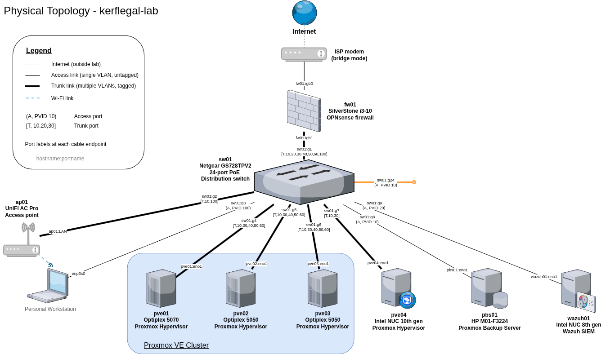
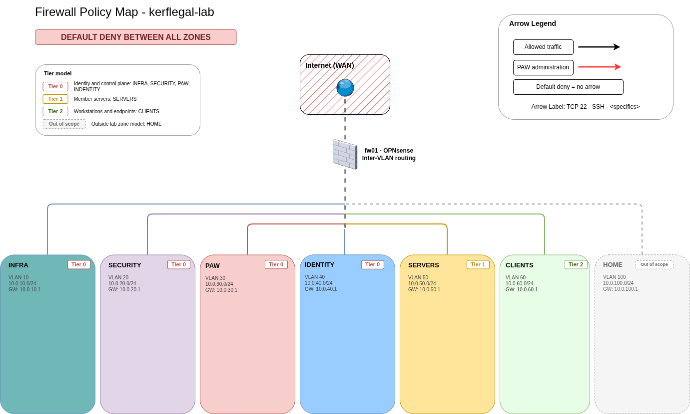

# Diagrams

Draw.io sources and exported PNGs for the kerflegal-lab environment.

## Logical Topology

Zones, VLANs, subnets. The canonical reference for firewall rules, DHCP scopes, and device records.

## Physical Topology

What's plugged into what. Used for cable tracing, connectivity troubleshooting, and hardware planning.

## Firewall Policy Map

Allowed traffic between zones. Easier to audit than the OPNsense rule table.

## Planned

- **Service Dependency Map** — What breaks if I take this down. Drives maintenance planning, blast radius assessment, and backup priorities.
- **AD Structure** — OU hierarchy, GPO linkage, group relationships.
- **Backup Flow** — What's backed up, where it lands, how to restore.
- **Log Flow** — What generates logs, where they go, what processes them.
